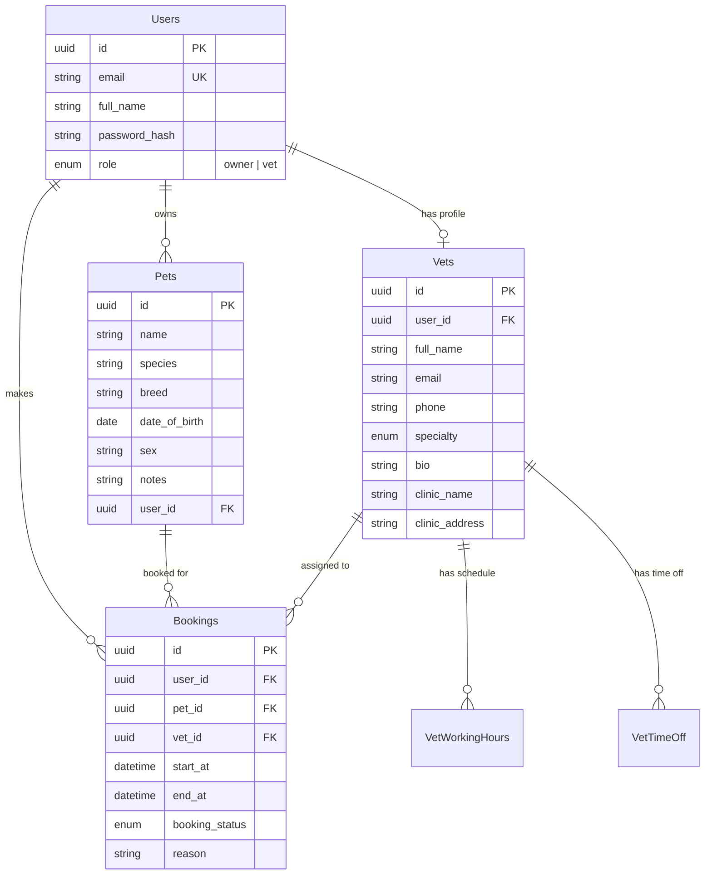

<p align="center">
  <h1 align="center">🐾 Petique</h1>
  <p align="center">
    <strong>A modern veterinary appointment platform for pet owners and veterinarians.</strong>
  </p>
  <p align="center">
    <a href="#features">Features</a> •
    <a href="#tech-stack">Tech Stack</a> •
    <a href="#getting-started">Getting Started</a> •
    <a href="#project-structure">Project Structure</a> •
    <a href="#api-endpoints">API Endpoints</a> •
    <a href="#docker">Docker</a>
  </p>
</p>

---

## Overview

Petique is a full-stack web application that connects **pet owners** with **veterinarians**. Owners can register their pets, browse available vets by specialty, and book appointments — while vets can manage their profiles, set working hours, and handle their schedules.

---

## Features

### 🐕 For Pet Owners
- **Pet Management** — Add, edit, and track all your pets in one place
- **Browse Veterinarians** — Search vets by specialty, view profiles and clinic details
- **Appointment Booking** — Book vet appointments with date/time selection
- **Booking History** — View and manage upcoming and past bookings
- **Dashboard** — At-a-glance overview of your pets and upcoming appointments

### 🩺 For Veterinarians
- **Professional Profile** — Manage bio, clinic info, specialty, and contact details
- **Working Hours** — Configure weekly availability schedules
- **Time Off** — Block out vacation days and unavailable dates
- **Appointment Management** — View and manage incoming bookings
- **Vet Dashboard** — Overview of schedule and appointment status

### 🔐 General
- **Authentication** — JWT-based login & registration with role-based access (Owner / Vet)
- **Role-Based Routing** — Separate dashboards and pages for each role
- **Responsive UI** — Modern, mobile-friendly interface with golden-yellow theme

---

## Tech Stack

### Backend
| Technology | Purpose |
|---|---|
| **FastAPI** | High-performance async API framework |
| **SQLModel** | ORM combining SQLAlchemy + Pydantic |
| **Alembic** | Database migration management |
| **PostgreSQL** (Neon) | Cloud-hosted relational database |
| **python-jose** | JWT token authentication |
| **Passlib + bcrypt** | Password hashing |
| **Uvicorn** | ASGI server |
| **Python 3.13** | Runtime |

### Frontend
| Technology | Purpose |
|---|---|
| **React 19** | UI library |
| **TypeScript** | Type safety |
| **Vite** | Build tool & dev server |
| **TailwindCSS** | Utility-first CSS framework |
| **React Router v7** | Client-side routing |
| **TanStack React Query** | Server state management & caching |
| **React Hook Form + Zod** | Form handling & schema validation |
| **Axios** | HTTP client |
| **Lucide React** | Icon library |
| **Sonner** | Toast notifications |

---

## Getting Started

### Prerequisites
- **Python** ≥ 3.13
- **Node.js** ≥ 18
- **PostgreSQL** database (or a [Neon](https://neon.tech) account)
- **uv** (recommended) or pip for Python dependency management

### 1. Clone the Repository
```bash
git clone https://github.com/tanishqsrivastavaa/petique-app.git
cd petique-app
```

### 2. Set Up Environment Variables

Create a `.env` file in the project root:
```env
DATABASE_URL=postgresql://<user>:<password>@<host>/<dbname>?sslmode=require
jwt_token_secret_key=<your-secret-key>
```

Create a `.env` file in `frontend/petique-frontend/`:
```env
VITE_API_BASE_URL=http://localhost:8000/api/v1
```

### 3. Backend Setup
```bash
# Install Python dependencies (using uv)
uv sync

# Or using pip
cd backend
pip install -r requirements.txt

# Run database migrations
cd backend
alembic upgrade head

# Start the backend server
uvicorn main:app --reload
```
The API will be available at `http://localhost:8000`. Interactive docs at `http://localhost:8000/docs`.

### 4. Frontend Setup
```bash
cd frontend/petique-frontend

# Install dependencies
npm install

# Start the dev server
npm run dev
```
The app will be available at `http://localhost:5173`.

---

## Project Structure

```
petique-app/
├── backend/
│   ├── app/
│   │   ├── api/v1/           # API route handlers
│   │   │   ├── users.py      # Auth & user endpoints
│   │   │   ├── pets.py       # Pet CRUD endpoints
│   │   │   ├── vets.py       # Vet profile endpoints
│   │   │   └── bookings.py   # Booking endpoints
│   │   ├── core/             # Config & security utilities
│   │   ├── crud/             # Database operations
│   │   │   ├── users.py
│   │   │   ├── pets.py
│   │   │   ├── vets.py
│   │   │   ├── bookings.py
│   │   │   ├── vet_working_hours.py
│   │   │   └── vet_time_off.py
│   │   ├── models/           # SQLModel database models
│   │   │   ├── users.py
│   │   │   ├── pets.py
│   │   │   ├── vets.py
│   │   │   ├── bookings.py
│   │   │   ├── vet_working_hours.py
│   │   │   ├── vet_time_off.py
│   │   │   └── enums.py
│   │   └── schema/           # Pydantic request/response schemas
│   ├── alembic/              # Database migrations
│   ├── main.py               # FastAPI app entrypoint
│   ├── Dockerfile            # Production Docker image
│   └── requirements.txt
│
├── frontend/
│   └── petique-frontend/
│       ├── src/
│       │   ├── pages/
│       │   │   ├── Login.tsx
│       │   │   ├── Register.tsx
│       │   │   ├── Dashboard.tsx
│       │   │   ├── owner/        # Pet owner pages
│       │   │   │   ├── MyPets.tsx
│       │   │   │   ├── BrowseVets.tsx
│       │   │   │   ├── VetDetail.tsx
│       │   │   │   └── MyBookings.tsx
│       │   │   └── vet/          # Veterinarian pages
│       │   │       ├── VetDashboard.tsx
│       │   │       ├── VetProfile.tsx
│       │   │       ├── Schedule.tsx
│       │   │       └── TimeOff.tsx
│       │   ├── components/       # Reusable UI components
│       │   ├── lib/              # Utilities & API client
│       │   ├── routes/           # Route guards (role-based)
│       │   ├── router.tsx        # App routing config
│       │   └── main.tsx          # React entrypoint
│       ├── package.json
│       └── tailwind.config.js
│
├── pyproject.toml
└── .env                      # Environment variables (not committed)
```

---

## API Endpoints

All endpoints are prefixed with `/api/v1`.

### Users & Auth
| Method | Endpoint | Description |
|---|---|---|
| `POST` | `/users/register` | Register a new user |
| `POST` | `/users/login` | Login and receive JWT token |
| `GET` | `/users/me` | Get current user profile |

### Pets
| Method | Endpoint | Description |
|---|---|---|
| `GET` | `/pets/` | List user's pets |
| `POST` | `/pets/` | Add a new pet |
| `PUT` | `/pets/{id}` | Update pet details |
| `DELETE` | `/pets/{id}` | Remove a pet |

### Veterinarians
| Method | Endpoint | Description |
|---|---|---|
| `GET` | `/vets/` | List all veterinarians |
| `GET` | `/vets/{id}` | Get vet profile details |
| `PUT` | `/vets/profile` | Update vet profile |

### Bookings
| Method | Endpoint | Description |
|---|---|---|
| `GET` | `/bookings/` | List user's bookings |
| `POST` | `/bookings/` | Create a new booking |
| `PATCH` | `/bookings/{id}` | Update booking status |

---

## Docker

### Build the Backend Image
```bash
cd backend
docker build -t petique-backend .
```

### Run the Container
```bash
docker run -d \
  -p 8000:8000 \
  --env-file ../.env \
  petique-backend
```

---

## Database Schema



---

## License

This project is private and not currently licensed for public distribution.

---

<p align="center">
  Built with ❤️ by <a href="https://github.com/tanishqsrivastavaa">Tanishq Srivastava</a>
</p>
